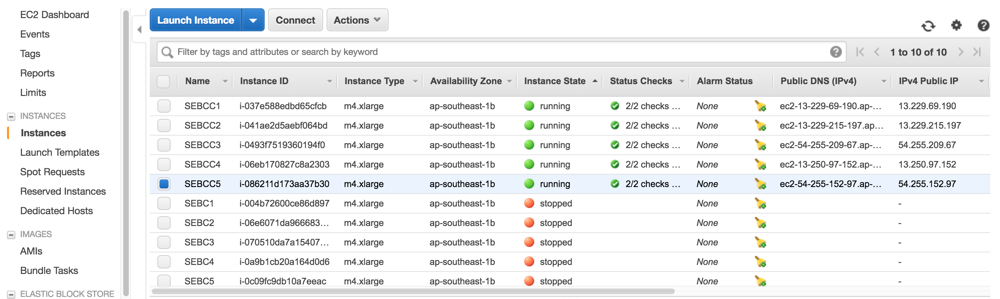

* Set up

1. List the cloud provider you are using <br/>
   Using AWS
2. List your instances by IP address and DNS name (don't use /etc/hosts for this) <br/>
    Snapshot of new instances
    <center>  </center>   
  ```  
  SEBCC1
    ec2-13-229-69-190.ap-southeast-1.compute.amazonaws.com
    13.229.69.190
    SEBCC2
    ec2-13-229-215-197.ap-southeast-1.compute.amazonaws.com
    13.229.215.197
    SEBCC3
    ec2-54-255-209-67.ap-southeast-1.compute.amazonaws.com
    54.255.209.67
    SEBCC4
    ec2-13-250-97-152.ap-southeast-1.compute.amazonaws.com
    13.250.97.152
    SEBCC5
    ec2-54-255-152-97.ap-southeast-1.compute.amazonaws.com
    54.255.152.9
```    
3. List the Linux release you are using<br/>
   CentOS7

4. List the file system capacity for the first node<br/>
   I am using m4.xlarge with 50GB
   using <code>df -T</code> here is the mounted
   | Filesystem   | Type | 1K-blocks  | Used    | Available  | Use% |Mounted on |
   | -------------|:----:|:----------:|:-------:|:----------:|:----:|:---------:|
   | /dev/xvda1   | xfs  | 52417516   | 863084  | 51554432   | 2%   | /         |

5. List the command and output for <code>yum repolist enabled</code> <br/>
```
Loaded plugins: fastestmirror
Loading mirror speeds from cached hostfile
 * base: centos.usonyx.net
 * extras: centos.usonyx.net
 * updates: centos.usonyx.net
repo id                                repo name                                 status
base/7/x86_64                          CentOS-7 - Base                           9911
extras/7/x86_64                        CentOS-7 - Extras                          258
updates/7/x86_64                       CentOS-7 - Updates                         151
repolist: 10320
```


6. Add the following Linux accounts to all nodes
  * User jimenez with a UID of 2800
  * User beltran with a UID of 2900
  * Create the group astros and add beltran to it
  * Create the group rangers and add jimenez to it
  * List the /etc/passwd entries for jimenez and beltran Do not list the entire file
  ```
  jimenez:x:2800:1001::/home/jimenez:/bin/bash
  beltran:x:2900:1002::/home/beltran:/bin/bash
  ```
  * List the /etc/group entries for astros and rangers
  ```
  rangers:x:1001:
  astros:x:1002:
  ```
