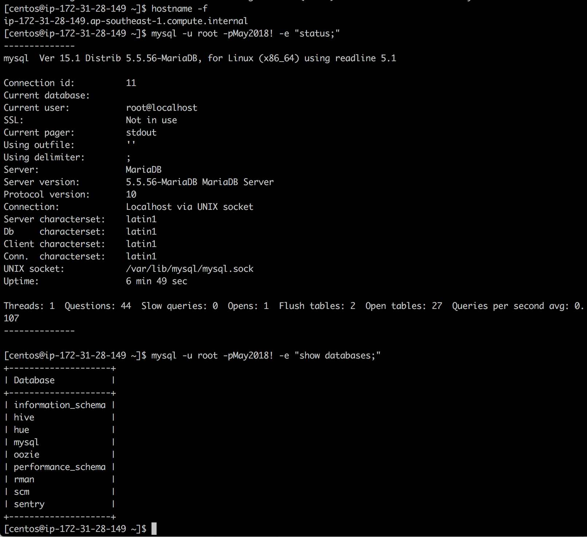

1. The command hostname -f and its output
 
2. The command mysql -u <user> -p<password> -e "status;" and its output
 
3. The command mysql -u <user> -p<password> -e "show databases;" and its output
 
For All 3 please refer to below screenshot

  

