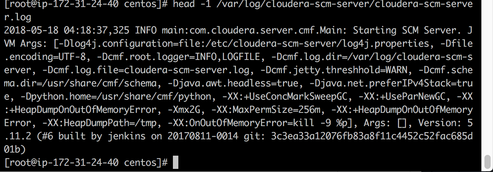
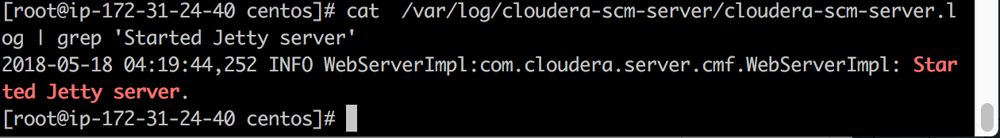

* First Line of CM Server Log<br/>
```
2018-05-18 04:18:37,325 INFO main:com.cloudera.server.cmf.Main: Starting SCM Server. JVM Args: [-Dlog4j.configuration=file:/etc/cloudera-scm-server/log4j.properties, -Dfile.encoding=UTF-8, -Dcmf.root.logger=INFO,LOGFILE, -Dcmf.log.dir=/var/log/cloudera-scm-server, -Dcmf.log.file=cloudera-scm-server.log, -Dcmf.jetty.threshhold=WARN, -Dcmf.schema.dir=/usr/share/cmf/schema, -Djava.awt.headless=true, -Djava.net.preferIPv4Stack=true, -Dpython.home=/usr/share/cmf/python, -XX:+UseConcMarkSweepGC, -XX:+UseParNewGC, -XX:+HeapDumpOnOutOfMemoryError, -Xmx2G, -XX:MaxPermSize=256m, -XX:+HeapDumpOnOutOfMemoryError, -XX:HeapDumpPath=/tmp, -XX:OnOutOfMemoryError=kill -9 %p], Args: [], Version: 5.11.2 (#6 built by jenkins on 20170811-0014 git: 3c3ea33a12076fb83a8f11c4452c52fac685d01b)
```
<center>  </center>

<br/>
* Jetty Server line

<br/>
```
2018-05-18 04:19:44,252 INFO WebServerImpl:com.cloudera.server.cmf.WebServerImpl: Started Jetty server.
```
<br/>
<center>  </center>
